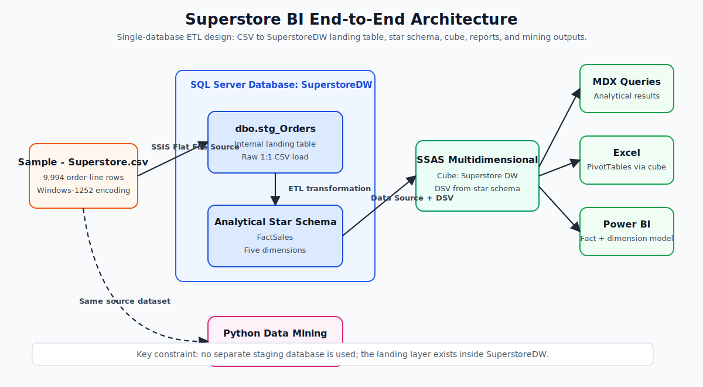
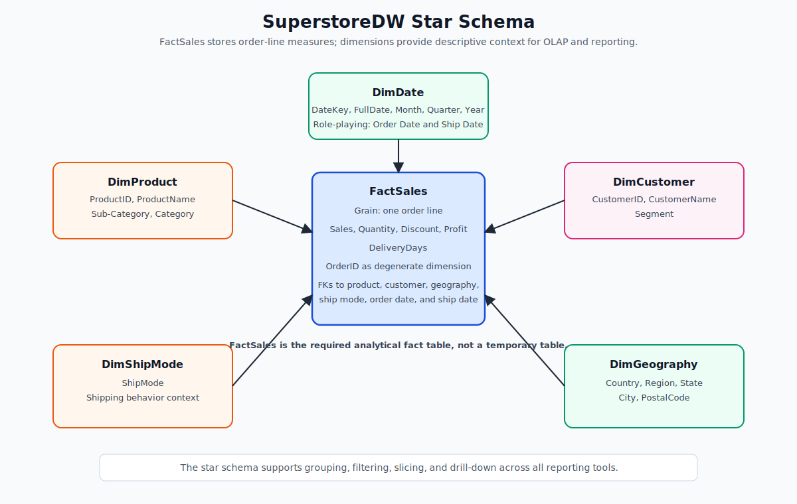
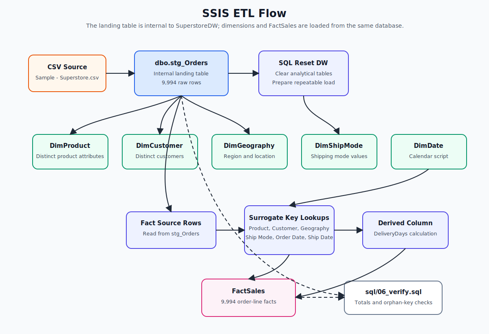
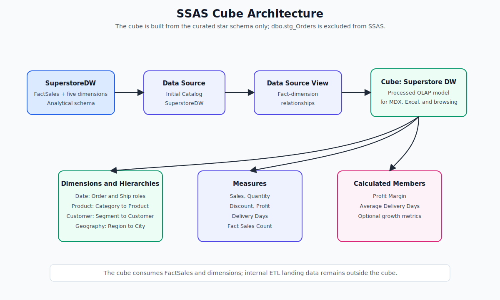
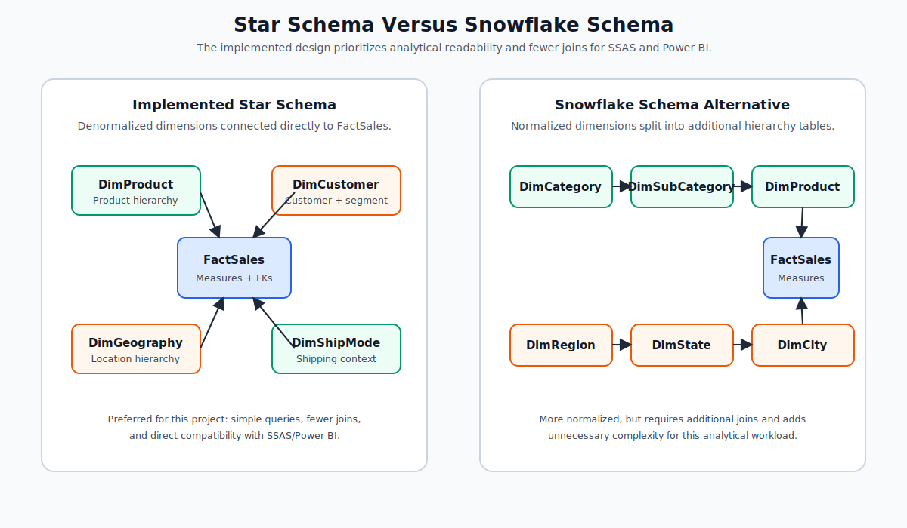
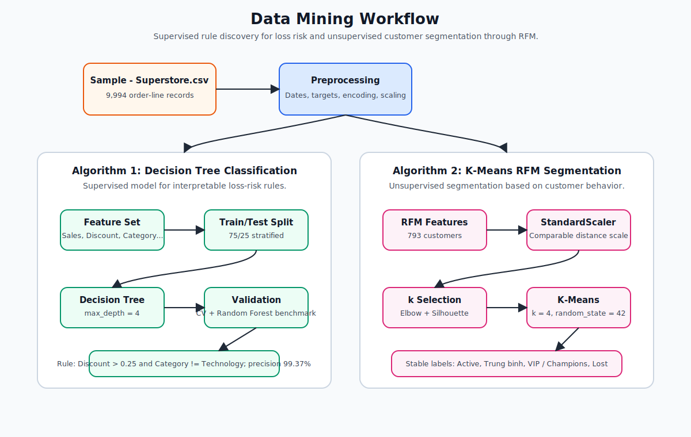

# Superstore BI Final Project - System Diagrams

This document consolidates the main architectural and analytical diagrams for the Superstore Business Intelligence final project. The diagrams are embedded as rendered SVG images, so they are visible directly in Markdown preview without requiring a Mermaid extension.

Contents: [1. End-to-End Architecture](#1-end-to-end-architecture) | [2. Star Schema Data Warehouse](#2-star-schema-data-warehouse) | [3. SSIS ETL Flow](#3-ssis-etl-flow) | [4. SSAS Cube Architecture](#4-ssas-cube-architecture) | [5. Star Schema Versus Snowflake Schema](#5-star-schema-versus-snowflake-schema) | [6. Data Mining Workflow](#6-data-mining-workflow)

---

## 1. End-to-End Architecture

**Interpretation:** The source CSV file is loaded by SSIS directly into the main SQL Server database, `SuperstoreDW`. The table `dbo.stg_Orders` is an internal landing table inside the same database, not a separate temporary database. The curated analytical layer is the star schema composed of `FactSales` and five dimensions. SSAS, Power BI, and Excel consume only the analytical schema or the cube. The Python data mining module uses the same Superstore source data to derive additional predictive and segmentation insights.

---

## 2. Star Schema Data Warehouse

**Interpretation:** `FactSales` is not a temporary table. It is the central fact table of the dimensional model and stores the measurable business events at order-line grain. The dimension tables provide descriptive context for grouping, filtering, slicing, and drilling into the measures.

---

## 3. SSIS ETL Flow

**Interpretation:** The term landing or staging is used here as an ETL layer inside the main data warehouse database. It does not indicate a separate staging database. The CSV file is first loaded into `SuperstoreDW.dbo.stg_Orders`; the dimensional tables and fact table are then populated from this internal landing table.

---

## 4. SSAS Cube Architecture

**Interpretation:** SSAS does not consume `dbo.stg_Orders`. The cube is built only from the curated star schema in `SuperstoreDW`: `FactSales` and the five dimension tables.

---

## 5. Star Schema Versus Snowflake Schema

**Interpretation:** The project adopts a star schema because it is easier to query, more convenient for SSAS and Power BI, and requires fewer joins during analytical workloads. A snowflake schema could reduce redundancy through additional normalization, but it would also introduce more joins and unnecessary modeling complexity for the Superstore dataset.

---

## 6. Data Mining Workflow

**Interpretation:** The data mining component uses two complementary algorithms. The Decision Tree is a supervised learning model used to classify order lines and extract interpretable loss-risk rules. K-Means is an unsupervised learning model used to segment customers based on RFM behavior.

